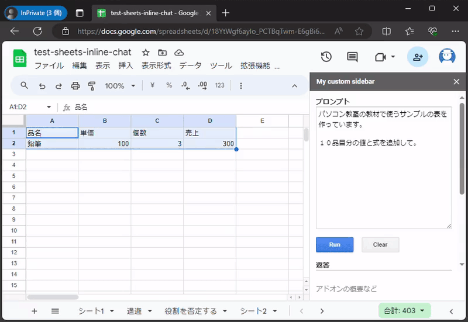

# test-sheets-addon-inline-chat

Google スプレッドシートに Gemini API を使ったチャットを埋め込む実験。

> [!NOTE]
>
> この動画は 1.5 倍速で再生されています。

## 現状できていること

[関数呼び出し](https://ai.google.dev/docs/function_calling?hl=ja)を利用して以下の操作が行える。

- 値や式をセットする(式は単純な四則演算と `SUM` のみ許可)
- 罫線や交互の背景色などの変更

これを Run すると

こうなる(売上列は式になっている)。

こういう感じにもなる(フッターが指定されているが見なかったことにする)

## 関数呼び出しで不明な点

- １回のターンで複数の関数は呼び出されない？
- 関数パラメーターのスキーマーが無視されるときがあるけどそういうもの？

## マルチモーダル

`gemini-pro-vision` モデルはまだ関数呼び出しに対応していないので、こういう感じになる。

Google ドライブに画像をアップロード(Google ドライブのサムネイルを使うため)

[5 つの赤いイチゴ](https://unsplash.com/ja/%E5%86%99%E7%9C%9F/5%E3%81%A4%E3%81%AE%E8%B5%A4%E3%81%84%E3%82%A4%E3%83%81%E3%82%B4--MUWGuW_yz4) : Photo by [Chris Bayer](https://unsplash.com/ja/@chrisbay101)

アップロードしたファイルを指定して、変更箇所を確認する

普通のチャットで変更を指示する。

将来、関数呼び出しに対応したら画像からそのまま更新できるのでないかな。たぶん。

## その他

複数回 Run してもマルチターンにはならない(シングルターンが複数回実行されるだけ)。

リポジトリ名に addon と付いているけど、Addon 用の設定にはなっていない。
